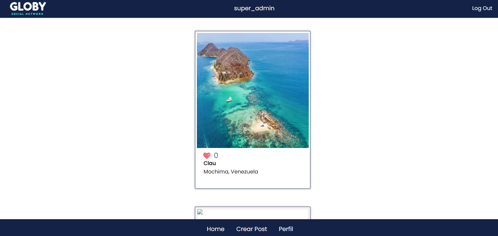
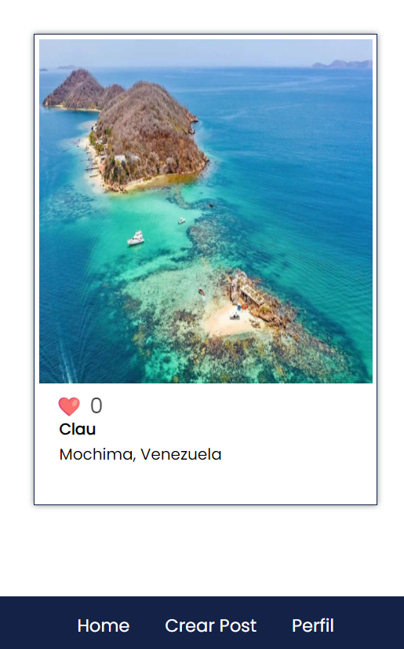
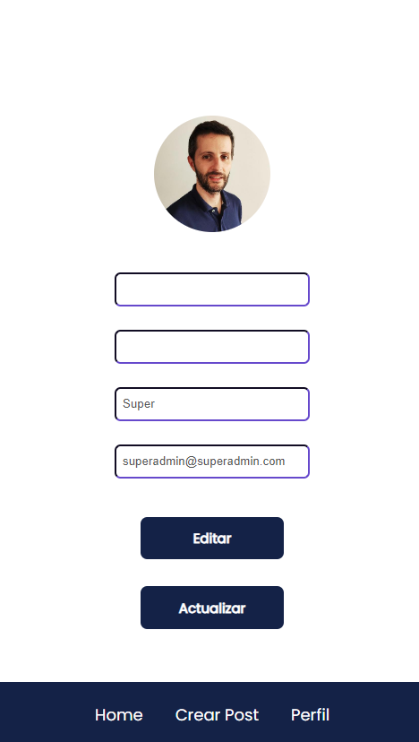
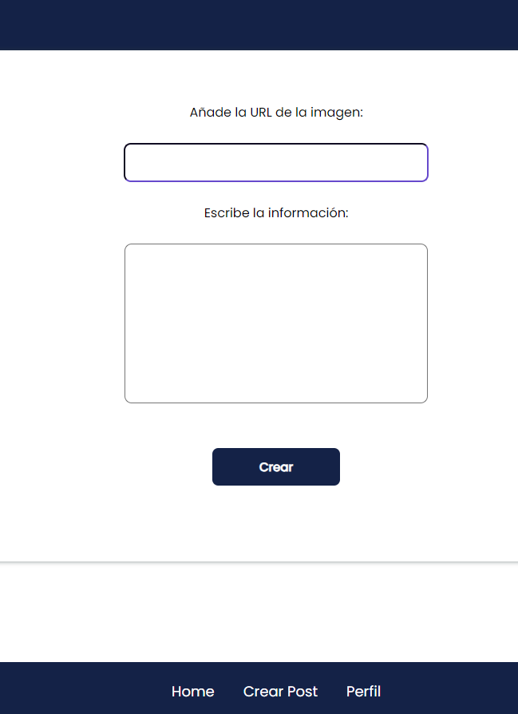
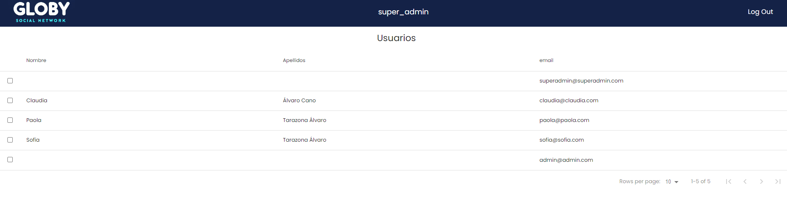

# Welcome to my frontend app  

<details>
  <summary>Contenido 📝</summary>
  <ol>
    <li><a href="#objetivo-🎯">Objetivo</a></li>
    <li><a href="#sobre-el-proyecto-🔎">Sobre el proyecto</a></li>
    <li><a href="#stack">Stack</a></li>
    <li><a href="#instalación-en-local">Instalación</a></li>
    <li><a href="#vistas">Vistas</a></li>
    <li></li>
    <li><a href="#contribuciones">Contribuciones</a></li>
    <li><a href="#licencia">Licencia</a></li>
    <li><a href="#desarrollo">Desarrollo</a></li>
    <li><a href="#contacto">Contacto</a></li>
  </ol>
</details>

## Objetivo 🎯
Este proyecto requería usar REACT para implementar el trabajo realizado de backend del siguiente repositorio:

https://github.com/klauha/proyecto5-RRSS-API-MONGO

## Sobre el proyecto 🔎
Se trata de una red social donde los usuarios pueden crear sus propios post con imagenes y el resto de usauarios pueden dar likes.   
  

## Stack
<div align="center">
<a href="https://www.reactjs.com/">
    
</a>
<a href="https://developer.mozilla.org/es/docs/Web/JavaScript">
    
</a>
 </div>

## Instalación en local
1. Primero deberemos seguir los pasos del repositorio del backend
2. Clonar este repositorio
3. ` $ npm install `
4. ``` $ npm run dev ```

## Vistas
 






## Contribuciones
Las sugerencias y aportaciones son siempre bienvenidas.  

Puedes hacerlo de dos maneras:

1. Abriendo una issue
2. Crea un fork del repositorio
    - Crea una nueva rama  
        ```
        $ git checkout -b feature/nombreUsuario-mejora
        ```
    - Haz un commit con tus cambios 
        ```
        $ git commit -m 'feat: mejora X cosa'
        ```
    - Haz push a la rama 
        ```
        $ git push origin feature/nombreUsuario-mejora
        ```
    - Abre una solicitud de Pull Request

## Licencia
Este proyecto se encuentra bajo licencia de "Klauha"


## Desarrollo:

``` js
 const developer = "klauha";

 console.log("Desarrollado por: " + developer);
```  

## Contacto

<a href = "mailto:klauha@gmail.com"></a>

</p>